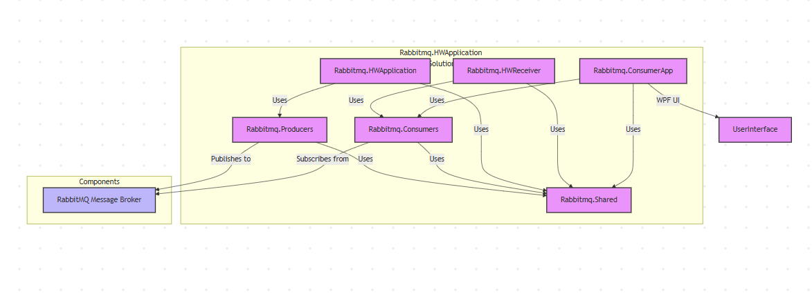

# RabbitMQ Solution Documentation

## Overview
This is a .NET solution that implements a message-based architecture using RabbitMQ. The solution is built using .NET (targeting .NET 8.0 and .NET 9.0 Windows) and consists of multiple projects that handle different aspects of message processing.

## Solution Structure

### Core Components

1. **Rabbitmq.Shared**
   - Contains shared data models and enums used across the solution
   - Includes `ModelState` enum with states: Created, Deleted, and Blocked

2. **Rabbitmq.Producers**
   - Handles message publishing to RabbitMQ
   - Responsible for sending messages to the message queue

3. **Rabbitmq.Consumers**
   - Contains consumer logic for processing messages from RabbitMQ
   - Implements message handling and processing functionality

### Applications

4. **Rabbitmq.ConsumerApp**
   - Standalone consumer application
   - Processes messages from the queue

5. **Rabbitmq.HWApplication**
   - Main application implementation
   - Likely contains the primary business logic and user interface (WPF)

6. **Rabbitmq.HWReceiver**
   - Specialized receiver implementation
   - Handles specific message receiving scenarios
   
### Architecture

## Technical Stack
- **Framework**: .NET 8.0 and .NET 9.0 Windows
- **Language**: C# 13.0
- **UI Framework**: WPF (Windows Presentation Foundation)
- **Message Broker**: RabbitMQ
- **Architecture**: Message-based / Event-driven

## Prerequisites
- .NET 8.0 SDK or later
- RabbitMQ Server
- Windows OS (due to WPF dependency)

## Getting Started
1. Ensure RabbitMQ server is installed and running
2. Build the solution using Visual Studio or Rider
3. Configure the necessary RabbitMQ connection settings
4. Start the required applications based on your use case:
   - Run Rabbitmq.HWApplication for the main application
   - Run Rabbitmq.ConsumerApp for message processing
   - Run Rabbitmq.HWReceiver for specialized receiving functionality

## Model States
The solution uses a `ModelState` enum to track entity states:
- `Created`: Represents a newly created entity
- `Deleted`: Represents a deleted entity
- `Blocked`: Represents a blocked entity

## Best Practices
1. **Message Handling**
   - Implement proper error handling in consumers
   - Use appropriate message acknowledgment patterns
   - Consider implementing retry policies

2. **Configuration**
   - Store RabbitMQ connection strings in configuration files
   - Use appropriate security measures for credentials

3. **Logging**
   - Implement comprehensive logging
   - Monitor message processing
   - Track errors and exceptions

## Notes
- The solution follows a modular architecture with separate projects for different concerns
- WPF is used for the user interface, making this a Windows-specific solution
- The project uses modern .NET features and C# 13.0 capabilities

This documentation provides a high-level overview of the solution. For more detailed information
about specific components or implementation details, please refer to the individual project documentation or code comments.
Let me know if you need more specific information about any component or aspect of the solution!